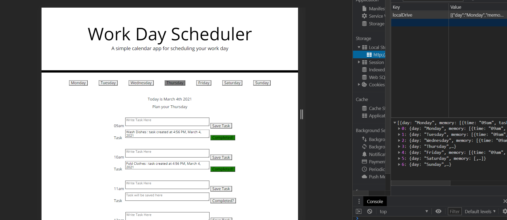

# Work Day Scheduler Starter Code

//FROM UCB

# Acceptance Critera

GIVEN I am using a daily planner to create a schedule
WHEN I open the planner
THEN the current day is displayed at the top of the calendar
WHEN I scroll down
THEN I am presented with time blocks for standard business hours
WHEN I view the time blocks for that day
THEN each time block is color-coded to indicate whether it is in the past, present, or future
WHEN I click into a time block
THEN I can enter an event
WHEN I click the save button for that time block
THEN the text for that event is saved in local storage
WHEN I refresh the page
THEN the saved events persist

# Usage and Installations

No installation is required
Note this application is using a depercated library ( MomentJS )

# About Application

This is a Work Day Scheduler to plan your week out and showcase my knowledge of javascript
This Application save your User input into yout Local Storage
Saving the date, time, and status of completion
Click a button to access to a form assiocated with that day and view or modify your data
Write in the input your task then press the submit button to save your task
Will you have your task saved below in the "Task" input field
The Task input have will the time and date it was created
You Then have the option to press the Task's "Complete?" button
This will mark the task as completed
If you do not mark your task as completed and 7 days pass, the task's button will mark itself as "Incomplete".

# Project Screenshot

